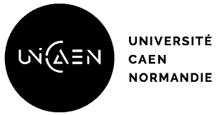

# Esup ORA : Approche par compétences

ORA est un logiciel open-source sur la refonte de l'offre de formation. On parle désormais d'approche par compétences.  

## Nouveautés

La [`liste des changements`](./documentation/patch-notes.md) est disponible ici et vous permettra de savoir :

- si une nouvelle version vous est proposée
- les nouveautés apportées par cette mise à jour
- les éventuels bugs ou failles corrigées
- procéder à son installation.  

## Documentation

Une [`documentation utilisateur`](./documentation/usage-documentation.md) est à votre disposition pour la configuration et la découverte de l'application.

Une [`documentation technique de l'application`](./documentation/technical-application-informations.md) concernant l'application est également présente.

Une [`documentation technique concernant la base de données`](./documentation/technical-database-informations.md).  

Une [`documentation technique pour le déploiement`](./documentation/technical-deployment-informations.md) vous est aussi proposée.

## Déploiement local d'ORA

Une [`procédure d'installation`](./documentation/installation.md) est à votre disposition pour déployer localement le projet ORA.  

