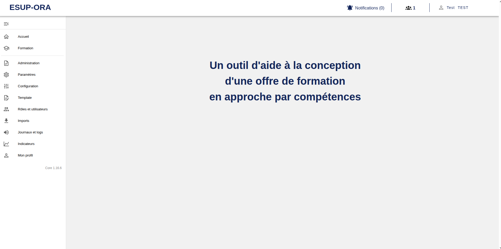
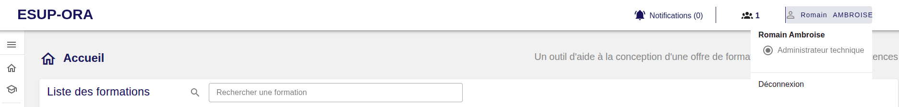

[`Retour au sommaire`](../entrypoint.md)  

## Squelette de l'application  

L'application Esup-ORA est décomposé en 3 parties :
1. La toolbar (menu du haut)
2. Le burger menu (menu enroulable à gauche)
3. La zone de travail (au centre)

  

### Menu bordereau (en haut de page) : la Toolbar

  

Par ce menu, vous pouvez observer les personnes qui sont actuellement sur la même formation que vous et qui contribuent aux modifications.  

Si vous cliquez sur votre Prénom - Nom, vous ferez apparaitre un mini menu, où vous pourrez changer de rôle en temps réel (cas de plusieurs rôles).  
Ou vous déconnecter.  

### Menu burger (partie gauche de la page)  

En fonction de votre rôle, vous pourrez accéder aux fonctionnalités d'Esup-ORA auquel vous avez le droit d'accéder.  
Pour cette documentation, nous sommes placer en tant que plus haut rôle applicatif.  

Le menu propose :  
1. <b>Accueil et formations</b>: c'est ici que vous pouvez accéder à la vue de création et d'accès aux formations.  
2. <b>Administration</b> : un sous menu d'administration
3. <b>Paramétrages</b> : Informations de votre instance
4. <b>Configuration</b> : Configuration de l'application (des établissements, des composantes et de leurs paramètres).
5. <b>Templates</b> : Configuration de bulles d'informations 
6. <b>Rôles et utilisateurs</b> : Promouvoir des utilisateurs, rattacher des utilisateurs à des composantes et à des formations. 
7. <b>Imports</b> : Import des composantes et des personnes de votre établissement
8. <b>Journaux et logs</b> : Historique des actions dans Esup-ORA
9. <b>Indicateurs </b>: tableaux de bord  
10. <b>Mon profil</b> : Mes informations personnelles dans Esup-ORA 

[`Passer à la suite : mon profil`](./2-mon-profil.md) 