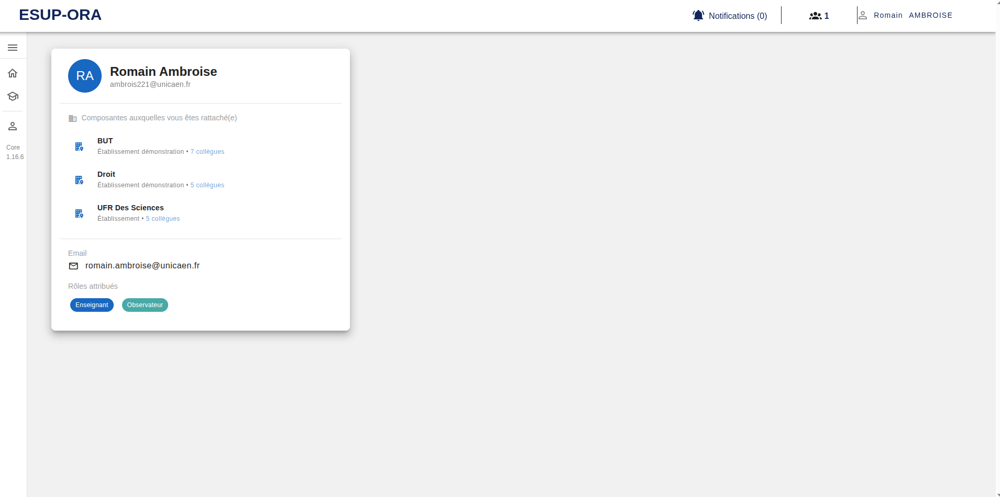

[`Retour au sommaire`](../entrypoint.md)  
[`Retour à la partie précédente : Aperçu de l'application et de mon profil`](../1-apercu/2-mon-profil.md) 

## Mon profil    

La vue mon profil vous permet de voir vos informations personnelles : 
- votre email
- Prénom - Nom
- persopass
Mais aussi les composantes auxquelles vous êtes rattaché.
Également les rôles avec en bleu, le rôle actuellement utilisé.  

  

[`Passer à la partie 2 : les paramétrages`](../2-parametrages/1-parametrages.md) 