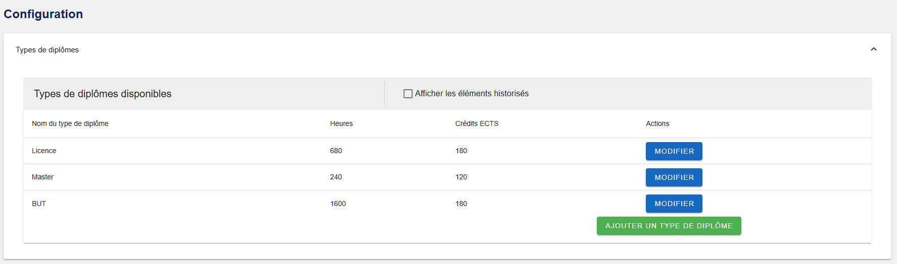
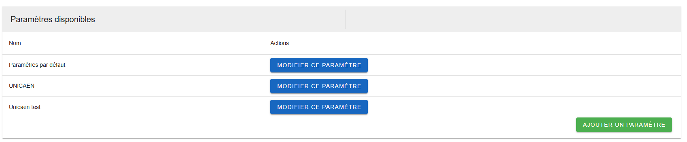
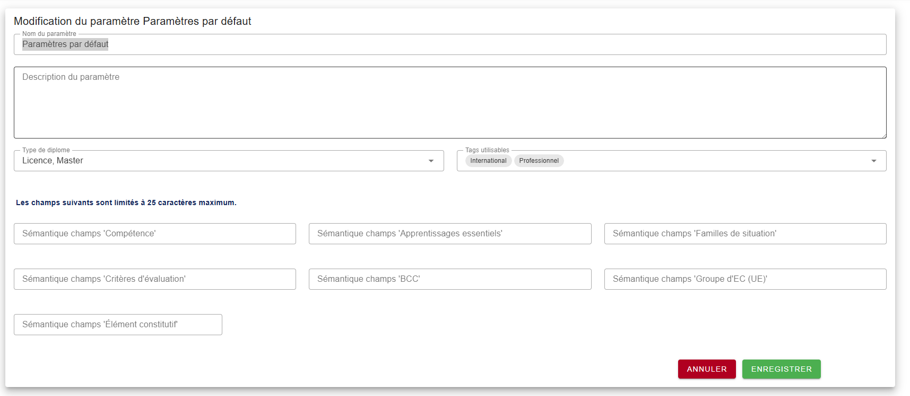
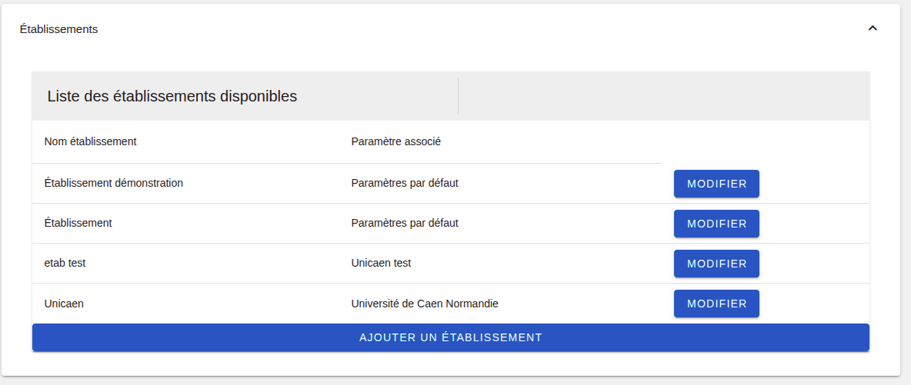
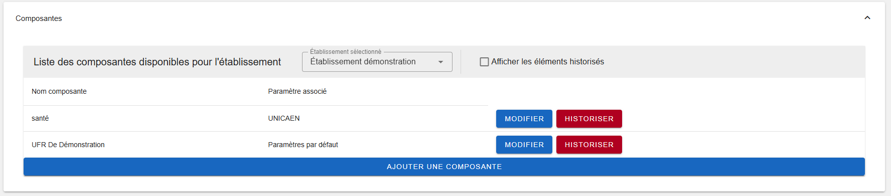

[`Retour au sommaire`](../entrypoint.md)  
[`Retour à la partie précédente : Aperçu de l'application et de mon profil`](../1-apercu/2-mon-profil.md) 

## Les configurations (paramètres) dans l'application.  

C'est ici que vous allez pouvoir configurer :  
- Les types de diplômes avec leurs quotas ECTS et heures enseignement.  
- Les tags
- Les paramétrages au niveau de la sémantique
- Créer des composantes
- Créer des établissements

Certains éléments de cette page peuvent être <b>historisés</b>.  
Vous pouvez afficher et restaurer les éléments historisés.  
Cette fonctionnalité permet de garder une trace de certains éléments sans qu'ils soient définitivement supprimés.  
<b>Pour qu'un élément puisse être historisés, il ne doit pas être dépendant d'un autre élément en cours d'exercice.</b>  

### Panneau de configuration  

Cette partie n'est accessible qu'uniquement pour les administrateurs <b>techniques</b> et <b>fonctionnels</b>.

1. #### Types de diplômes. 

Ajouter un nouveau type de diplôme et sauvegarder.

 

Les types de diplôme seront proposés au niveau de la création d'une offre de formation.  
Ils découleront de <b>l'association</b> de ce type de diplôme, <b>à un paramétrage puis à une composante</b>.  

2. #### Les tags. 

Ajouter un tag et sauvegarder.

 

Les tags seront proposés au niveau des enseignements d'une offre de formation, dans la partie maquette.  
Sous réserve qu'ils soient associés à un paramétrage et pré-importé (par la composante) dans l'offre de formation.  

3. #### Les paramètres à associer à une composante et à un établissement.  

Ajouter un paramètre, cliquer sur modifier puis saisissez les champs.  
  

  

Ici vous pouvez associer : 
- Les types de diplômes définis juste avant.  
- Les tags.

Note : vous pouvez laisser par défaut la sémantique, si la valeur par défaut vous convient.  
Autrement, vous pouvez personnaliser cette sémantique.  

4. #### Création d'un établissement et association d'un paramètre à un établissement.  

Voici la liste des établissements, vous pouvez y associer un paramétrage.  

  

5. #### Création d'une composante dans un établissement et association du paramètre.  

Ce tableau propose un filtrage des composantes par établissement.  
Si vous avez plusieurs établissements, vous pouvez en sélectionner un et ajouter des composantes à cet établissement.  

  

[`Passer à la partie 3 : les rôles et les privilèges associés.`](../3-roles-privileges/1-def-roles.md) 