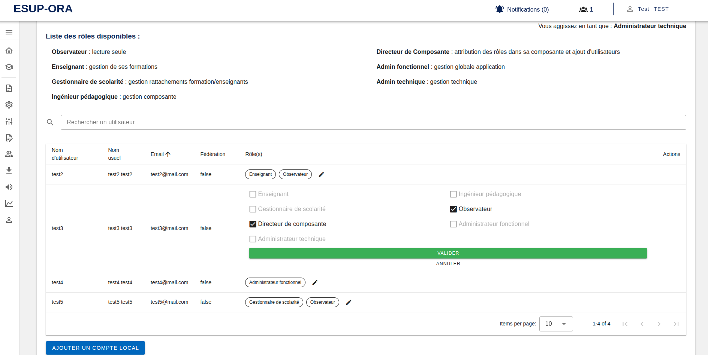
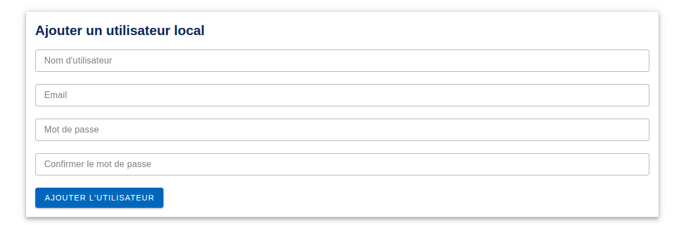

[`Retour au sommaire`](../entrypoint.md)  
[`Retour à la partie précédente : Définition des rôles et des privilèges`](../3-roles-privileges/1-def-roles.md) 

## Promouvoir un utilisateur.  

Suivant le rôle que vous possèdez, vous pouvez promouvoir un utilisateur jusqu'au rôle -1 par rapport au votre.  

  

Pour changer de rôle, il vous suffit de décocher le rôle principal (ici Directeur de Composante), et de cocher un autre rôle.  
Pour rappel, le rôle observateur est un rôle en lecture seule et este complémentaire avec un rôle principal.  

## Ajouter un utilisateur local  

Via le bouton dans la liste des utilisateurs, vous pouvez ajouter des comptes locaux.  

  

[`Passer à la suite : rattachement d'utilisateurs à des composantes`](../3-roles-privileges/3-rattacher-user-composante.md) 