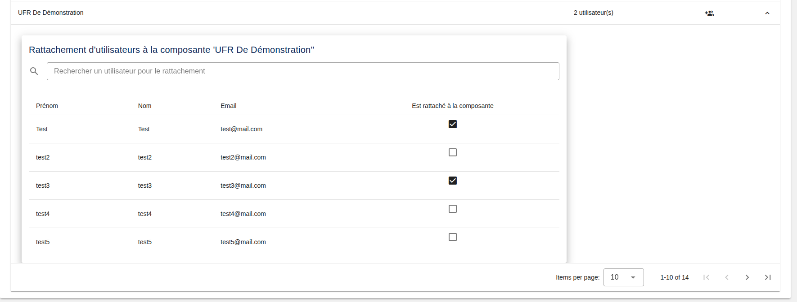

[`Retour au sommaire`](../entrypoint.md)  
[`Retour à la partie précédente : Promouvoir des utilisateurs`](../3-roles-privileges/2-promouvoir-user.md) 

## Rattacher des utilisateurs à des composantes

  

Pour chaque composante, vous pouvez ici, y rattacher des utilisateurs.

[`Passer à la suite : rattachement d'utilisateurs à des formations`](../3-roles-privileges/4-rattacher-user-formation.md) 