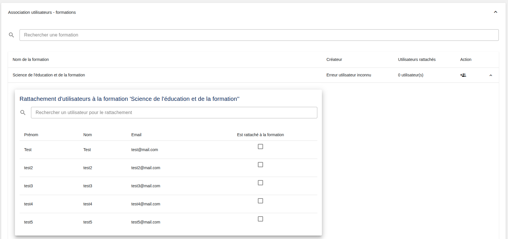

[`Retour au sommaire`](../entrypoint.md)  
[`Retour à la partie précédente : Rattachement d'utilisateurs à une composante`](../3-roles-privileges/3-rattacher-user-composante.md) 

## Rattacher des utilisateurs à des composantes

  

Pour chaque formation, vous pouvez ici, y rattacher des utilisateurs.  

[`Passer à la partie 4 : Création d'une offre de formation en Approche par Compétences`](../4-offre-formation/1-creation.md) 