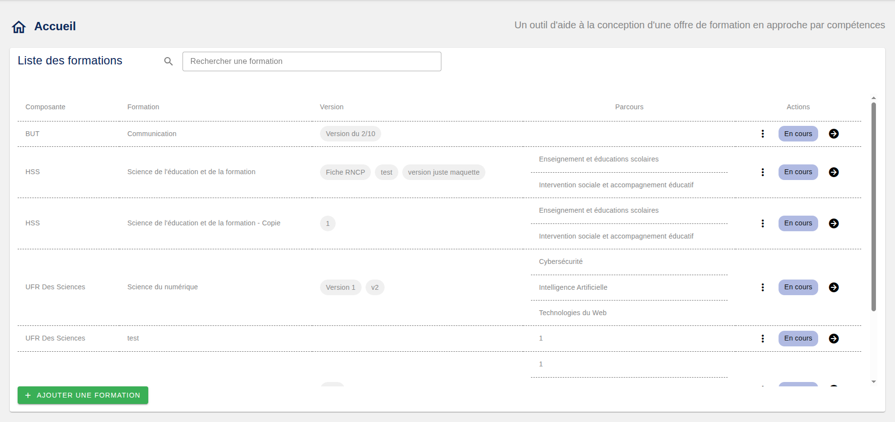
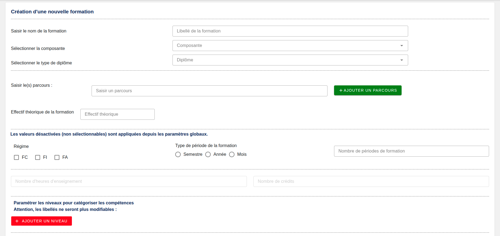
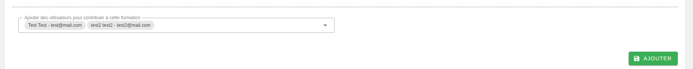
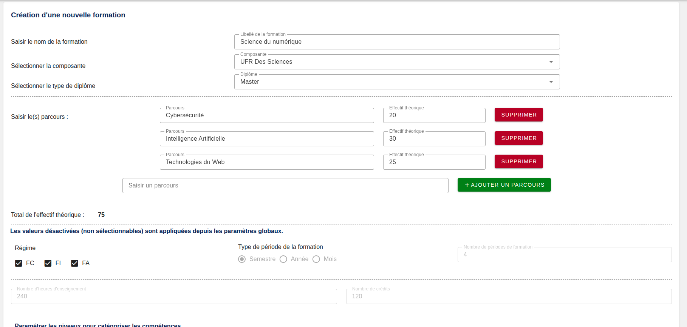
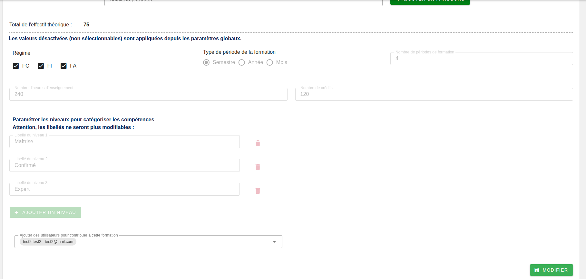

[`Retour au sommaire`](../entrypoint.md)
[`Retour à la partie 4 : Rattachement utilisateurs formations`](../3-roles-privileges/4-rattacher-user-formation.md)   

## La liste des formations  

Cette page est le point d'entrée de la partie métier de l'application Esup-ORA.  

Ici, vous pouvez voir les formations auxquelles vous êtes rattachés directement ou indirectement.  
Vous pouvez rechercher via un formulaire textuel.  
Accéder directement à des versions spécifiques, modifier via les trois points verticaux.  

  

Ou passer directement à l'étape de création.  
## Création d'une offre de formation en Approche par Compétences

  
  

Vous devez commencer par ajouter les informations suivantes :  
1. Le libellé de la formation. 
2. La composante de rattachement.  
Le paramétrage (tags, crédits ects, heures d'enseignements, types diplômes) est importé à ce niveau.
3. Le type de diplôme porté par la formation
4. Saisir au moins 1 ou plusieurs parcours
5. Effectif théorique global ou par parcours.
6. Le régime de la formation (FI,FA,FC)
7. Type de période semestres ? années ? mois ? 
8. Nombre de périodes pour la formation
9. Les heures et crédits sont importés
10. Les niveaux qui permettront de définir la suite des éléments.  
11. Les contributeurs (vous pourrez en ajouter en modifiant la formation plus tard). 

<b>Attention, à noter que les éléments 7,8,9 et 10 sont non modifiables par la suite</b>.

## Modification d'une offre de formation

Comme énoncé, certains éléments ne sont plus modifiables et donc grisés.  
  
  

[`Passer à la suite : les versions d'une formation`](../4-offre-formation/2-versions.md) 