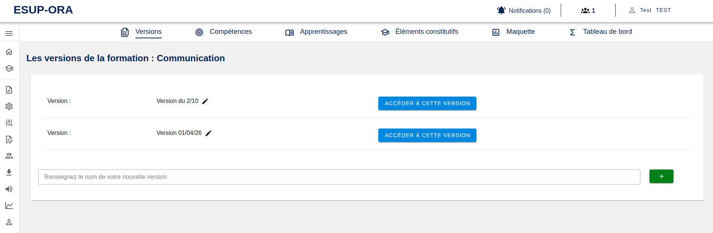

[`Retour au sommaire`](../entrypoint.md)
[`Retour à la partie précédente : créer une formation`](../4-offre-formation/1-creation.md) 

## Versionner une offre de formation

Pour différents besoins, vous pourrez avoir plusieurs versions de la même formation.  
À terme, vous serez également en mesure de dupliquer une version à un instant t, pour ensuite diverger entre ces deux versions.  

  

Avant de passer à la suite, vous pouvez voir qu'un mini-menu est apparu en haut de la zone de travail.  
Il est composé de chaque élément à définir pour valider une offre de formation en APC.  
Il vous permet de revenir en arrière ou de passer à la suite dans une offre de formation.   

  

Pour passer à la suite, j'accède à une version.  

[`Passer à la suite : créer des compétences`](../4-offre-formation/3-competences.md) 