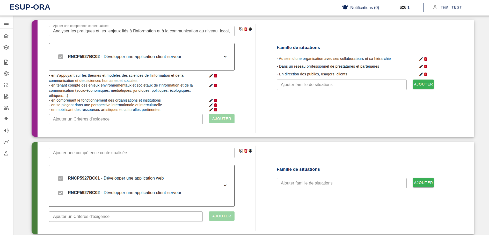
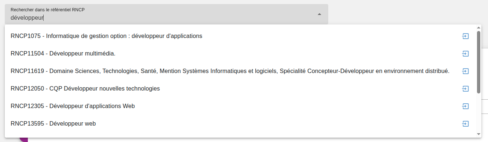
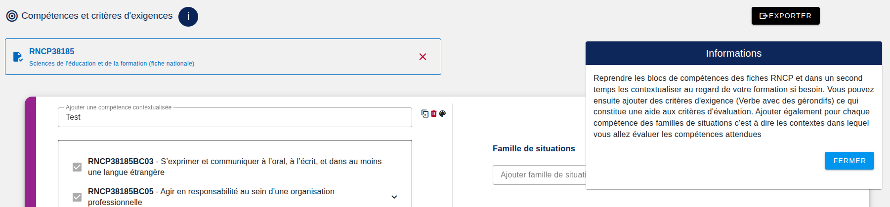

[`Retour au sommaire`](../entrypoint.md)
[`Retour à la partie précédente : versionning`](../4-offre-formation/2-versions.md) 

## Créer des compétences

Ici est le point d'entrée de la définition d'une offre de formation en approche par compétences.

On va définir des compétences qui seront marquées par un code couleur unique.  

  

Pour chaque compétence, je peux lui attribuer : 
- un libellé (une compétence contextualisée).  
- un ou plusieurs critères d'exigences.
- une ou plusieurs familles de situations.

  

Si besoin, je peux rechercher une fiche RNCP par son code national.  
En tapant par exemple : RNCP1075.  
Ou en faisant une recherche textuelle par le nom exacte du libellé de la fiche métier.  
Cela vous permettra ensuite, de débloquer les blocs de compétences rncp pour chacune des compétences ORA.  

  

Des bulles d'aides vont vous accompagner tout au long de la création de la formation.  
Vous pouvez les lire via le bouton 'I'.  

[`Passer à la suite : définir des apprentissages critiques`](../4-offre-formation/4-apprentissages-critiques.md) 