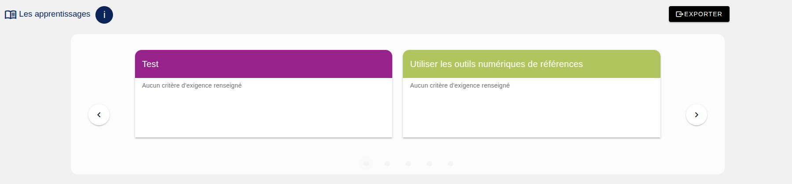
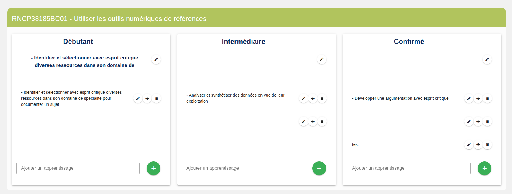

[`Retour au sommaire`](../entrypoint.md)
[`Retour à la partie précédente : créer des compétences`](../4-offre-formation/3-competences.md) 

## Définir des apprentissages critiques

Pour cette partie, nous retrouvons l'ensemble des compétences définies à l'étape précédente sous forme d'un carroussel.  
Si je clique sur une case (i.e. une compétence), elle est sélectionnée.  

  

Apparait ensuite en bas, l'ensemble des niveaux paramétrer à la création de la formation.  
Je peux ajouter des descriptions pour chaque niveau de chaque compétence.  
Mais surtout, je peux ajouter des apprentissages critiques dans chaque niveau de compétence.  

  

[`Passer à la suite : saisir des enseignements dans des périodes`](../4-offre-formation/5-enseignements.md) 