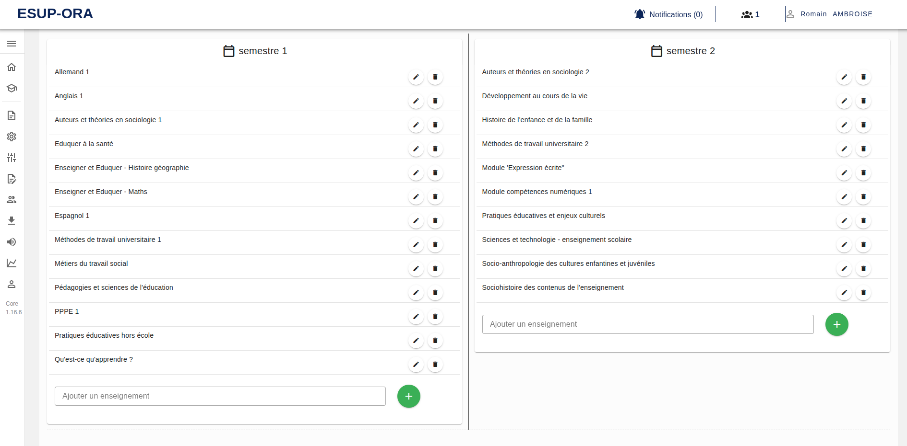

[`Retour au sommaire`](../entrypoint.md)
[`Retour à la partie précédente : définir des apprentissages critiques`](../4-offre-formation/4-apprentissages-critiques.md) 

## Saisir des enseignements par périodes

Ici, nous passons à un autre assemblage : les enseignements par périodes.  
Des périodes ont été définies à la création de la formation, on peut maintenant leur ajouter des enseignements.  

  

On peut naviguer entre chaque période, via la sélection en haut de la page.  
  

[`Passer à la suite : associer des enseignements à des apprentissages critiques`](../4-offre-formation/6-elements-constitutifs.md) 