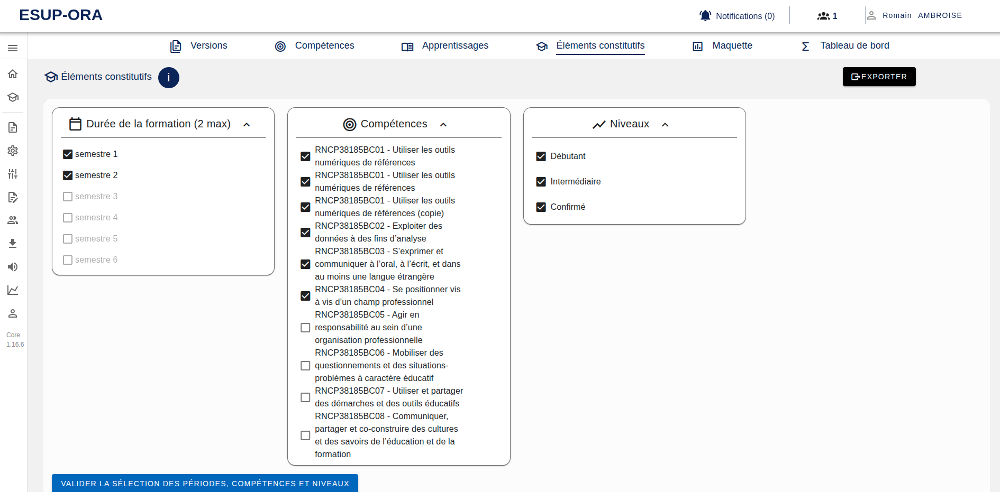
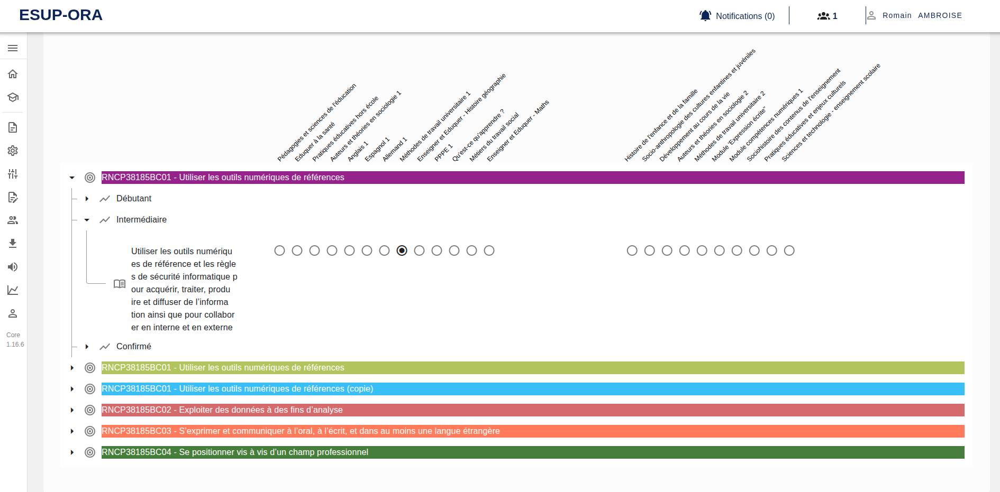

[`Retour au sommaire`](../entrypoint.md)
[`Retour à la partie précédente : saisir des enseignements par période`](../4-offre-formation/5-enseignements.md) 

## Associer des ACs à des Enseignements
Ensuite, pour charger le diagramme en arborescence et pouvoir associer des enseignements à des apprentissages critiques; il faut cocher les compétences voulues et les niveaux voulus.  
Je vous suggère de tout cocher.  

  

Puis, après un court chargement; ce tableau apparait :  

  

On retrouve nos compétences, colorés par leur code couleur.  
Mais également les apprentissages critiques par niveau de compétence, que l'on a définie juste avant.  

Maintenant, en cliquant à l'interséction d'un apprentissage critique et d'un enseignement; on va pouvoir définir une association entre ces deux éléments.  

<b>Cette étape est primordiale. C'est ici, que vous allez appeler vos compétences pour les enseignements.</b>

[`Passer à la suite : concevoir une maquette avec deux vues BCC ou Périodes`](../4-offre-formation/7-maquette.md) 