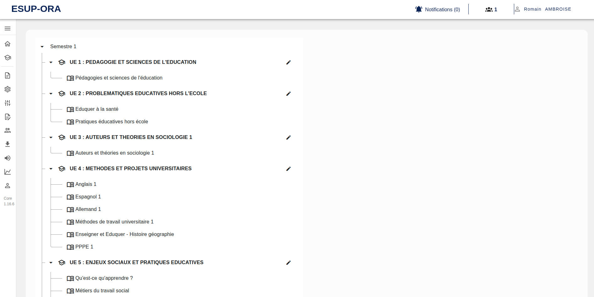
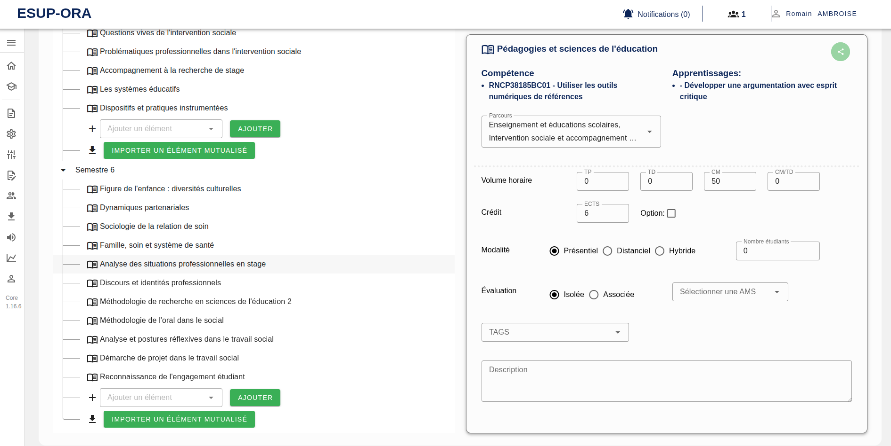
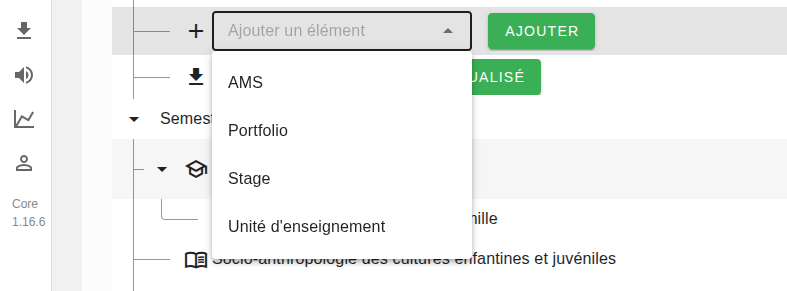
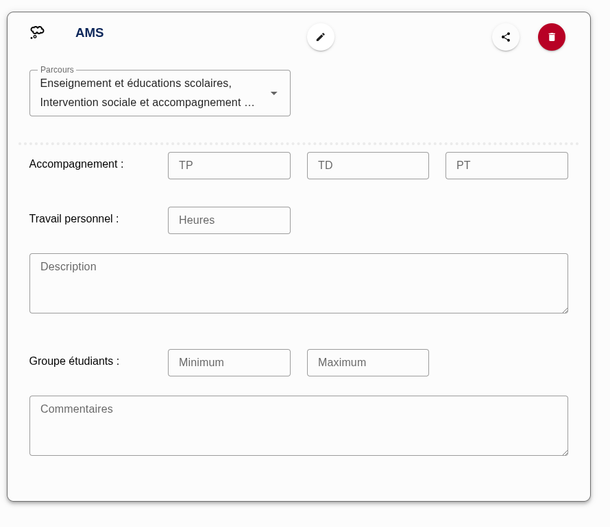
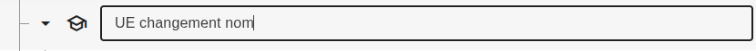
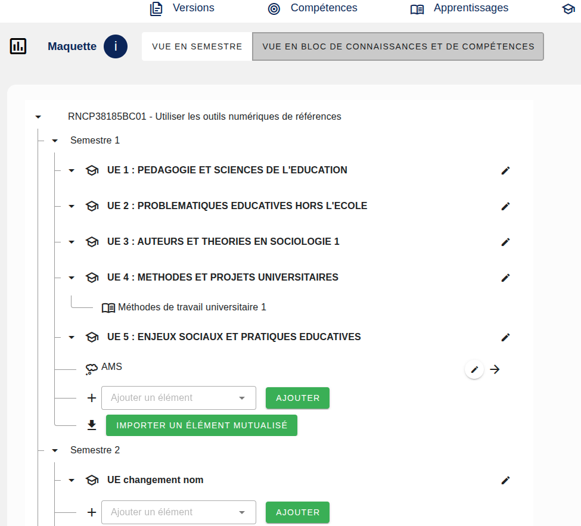

[`Retour au sommaire`](../entrypoint.md)
[`Retour à la partie précédente : Associer des ACs à des Enseignements`](../4-offre-formation/6-elements-constitutifs.md) 

## Concevoir une maquette avec deux vues en BCCs ou en Périodes

Pour cette partie, à la première connexion sur cette page, vous allez voir que vos enseignements vont s'importer automatiquement.  
Ils seront placer à la racine des périodes.  

  

Si vous cliquez sur un cours, vous pourrez lui attribuer des données descriptives tel que :  

  

Vous pouvez également ajouter d'autres éléments constituants la maquette. À savoir :
- AMS (Activité de Mise en Situation)
- Portfolio
- Stage
- UE (Unité d'Enseignement) et ainsi ranger des éléments dedans.  

  

Chaque élément est configurable :  

  

Vous pouvez changer le nom des UEs en cliquant sur le crayon :  

 

À terme, on pourra également ajouter des heures, crédits ects, au niveau de l'UE.  

Une deuxième vue en BCC est possible sur la partie Maquette.  
 

Cette vue est parfaite pour avoir la vision si tel ou tel élément est bien appelé par une compétence.  
En effet, si l'élément n'apparait pas, c'est qu'il n'est pas appelé par la compétence !  

[`Passer à la suite : mutualiser, partager des éléments`](../4-offre-formation/8-mutualisation.md) 