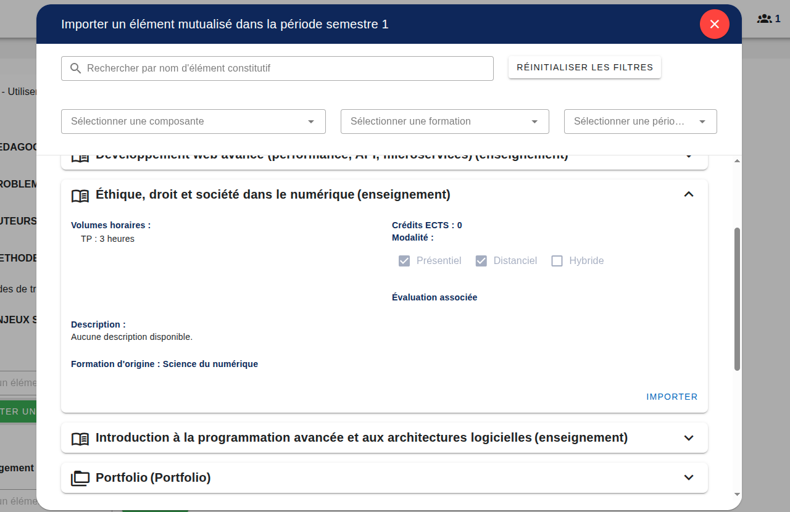

[`Retour au sommaire`](../entrypoint.md)
[`Retour à la partie précédente : Concevoir une maquette avec deux vues en BCCs ou en Périodes`](../4-offre-formation/7-maquette.md) 

## Mutualiser, partager des éléments et en importer.

Dans la partie maquette, il y a un bouton importer un élément mutualisé.  
Les éléments apparaissent dans ce menu, avec un rappel des données pré-configurés par la formation d'origine.  

 

Si vous cliquez sur importer, l'élément sera non modifiable mais importé dans votre offre de formation.  

 

[`Passer à la suite : visualiser l'offre de formation`](../4-offre-formation/9-visualisation-formation.md) 