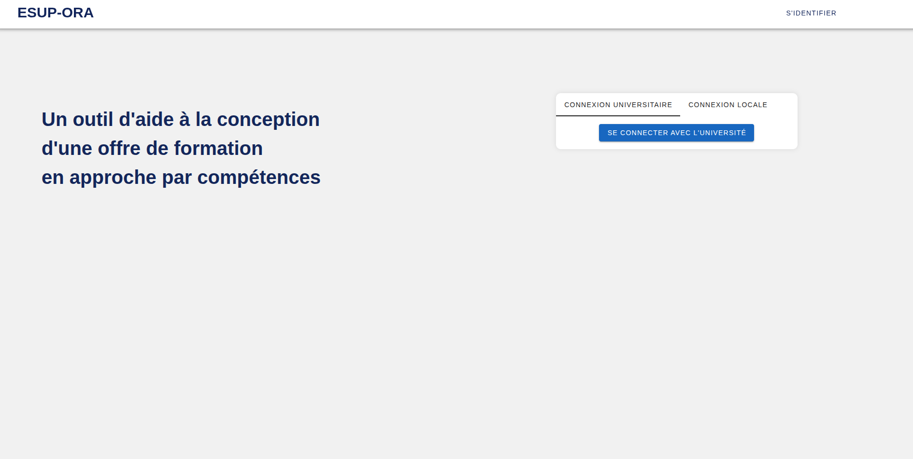
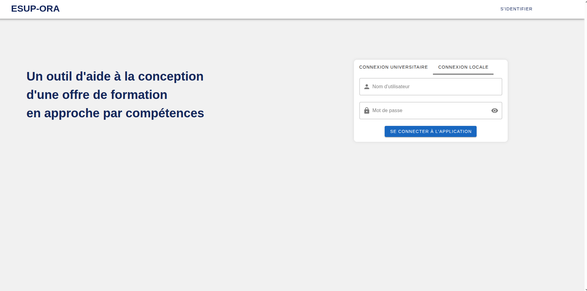
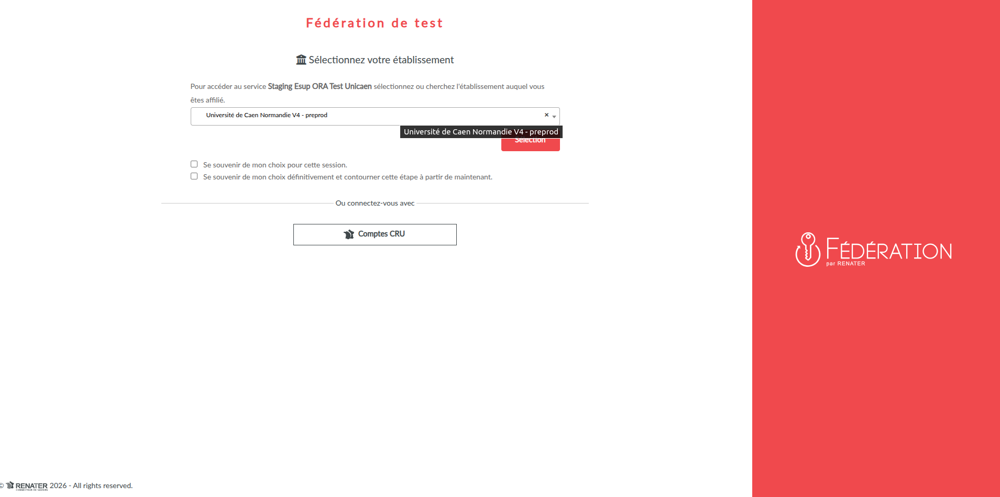
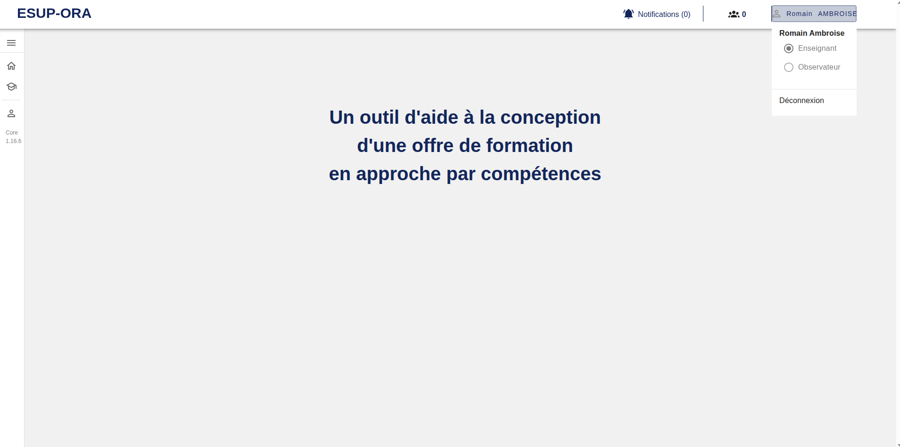

# Documentation Fonctionnelle - ESUP - ORA
 
  

## Aperçu du projet

ESUP ORA est un projet open-source porté par l'Université de Caen, Normandie.  
Proposé en mode SaaS via le Portail ESUP, cette application a pour vocation d'aider les équipes enseignantes à créer une <b>offre de formation en approche par compétences</b>.

## Point d'entrée

La page d'accueil propose un formulaire de connexion par deux biais :

- connexion <b>universitaire</b> (Renater-Shibboleth : système d'authentification universitaire national)
- compte <b>local</b>

    
    

Un premier compte local vous est fourni : <b>test</b> / <b>azerty</b>.  
Pour des mesures de sécurité, ce compte doit être désactivé après votre première connexion.  
Concernant la connexion universitaire, il vous sera demandé de sélectionner votre université dans une liste d'IDPs, comme le montre l'image ci-dessous :  

Ici, l'Université de Caen, Normandie est sélectionnée.  

  

Enfin, une fois la connexion finalisée, vous retournez sur l'application Esup-ORA en étant connecté avec votre persopass.  

## Sommaire de la documentation fonctionnelle  

1. #### Aperçu de la structure de l'application  

   - [`La navigation dans l'application`](./1-apercu/1-navigation.md) 
   - [`Mon profil`](./1-apercu/2-mon-profil.md) 
   - [`Changement de rôle`](./1-apercu/3-mes-roles.md) 

2. #### Paramétrage de l'application (Obligatoire pour la suite)
   - [`Définition des premiers paramétrages`](./2-parametrages/1-parametrages.md)
   - [`Création de votre établissement et de vos composantes`](./2-parametrages/2-etab-composantes.md)

3. #### Les rôles et privilèges d'ORA
   - [`Description des rôles`](./3-roles-privileges/1-def-roles.md)
   - [`Promouvoir un utilisateur`](./3-roles-privileges/2-promouvoir-user.md)
   - [`Rattacher un utilisateur à une composante`](./3-roles-privileges/3-rattacher-user-composante.md)
   - [`Contribuer à plusieurs sur une offre de formation `](./3-roles-privileges/4-rattacher-user-formation.md)

4. #### Développer une offre de formation en APC
   - [`Création de l'offre`](./4-offre-formation/1-creation.md)
   - [`Composer avec des versions de l'offre de formation`](./4-offre-formation/2-versions.md)
   - [`Définir des compétences via une fiche du référentiel RNCP`](./4-offre-formation/3-competences.md)
   - [`Créer des apprentissages critiques`](./4-offre-formation/4-apprentissages-critiques.md)
   - [`Ajouter des enseignements à vos périodes`](./4-offre-formation/usage-documentation.md)
   - [`Rattacher des enseignements à des apprentissages critiques pour la suite de la maquette`](./4-offre-formation/5-enseignements.md)
   - [`Définir les éléments constituants votre futur maquette en APC`](./4-offre-formation/6-elements-constitutifs.md)
   - [`Utiliser la mutualisation`](./4-offre-formation/8-mutualisation.md)
   - [`Visualiser votre offre`](./4-offre-formation/9-visualisation-formation.md)
   - [`Exporter chaque partie en Excel ou PDF`](./4-offre-formation/10-export-pdf-excel.md)  
