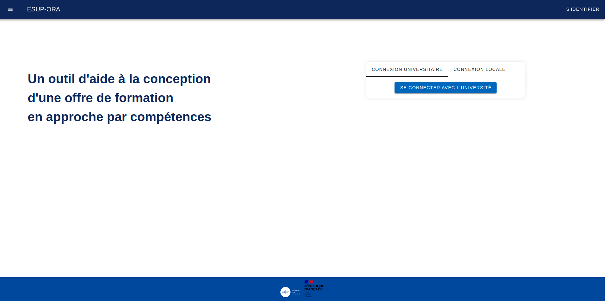

# Documentation Fonctionnelle - ESUP - ORA  

## Aperçu

ESUP ORA est un projet Open-Source porté par l'Université de Caen, Normandie.  
Cette application a pour vocation d'aider les équipes enseignantes à créer une offre de formation en <b>approche par compétences</b>.

## Point d'entrée

La page d'accueil proposera un formulaire de connexion par deux biais :
- connexion universitaire (Renater-Shibboleth : Système d'authentification Université National)
- compte local

    

        
    

    

        
    

Cette page est également accessible via le menu du haut et le bouton 'S'identifier'.
Pour l'exemple, nous utiliserons un compte local sur une instance 'vide'.

## Utilisateur par défaut.  

### [`Passer à la suite et notamment la création d'une offre de formation`](./create-formation.md)