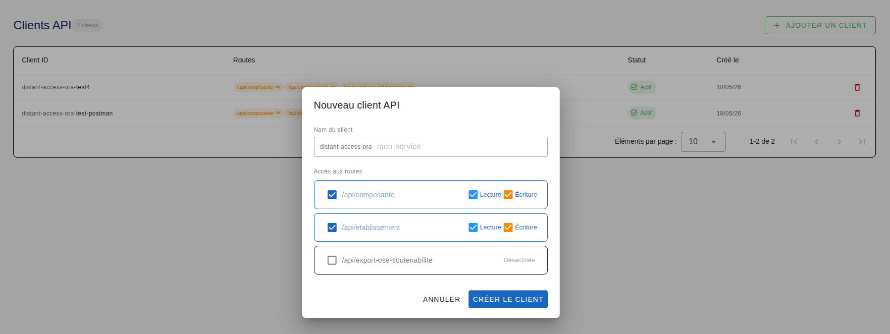
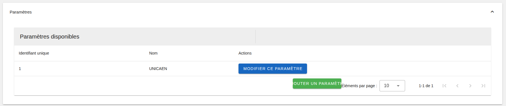

# Importation des Établissements et Composantes via connecteur

Cette documentation s'adresse aux administrateurs et développeurs souhaitant automatiser l'intégration des structures d'enseignement (Établissements et Composantes) dans l'application Esup-ORA.

## 1. Création des clients connecteur depuis le frontend d'ORA

En tant qu'administrateur technique, vous serez en mesure d'accéder à la page de création des clients API.  
La capture d'écran ci-dessous montre l'activation d'un client API sur deux routes : composante et etablissement.  




Une fois le client créé, vous allez être en mesure de passer à la suite.  

## 2. Informations préalables.

À noter que la suite de la documentation se base sur l'exemple des scripts présent sur la dépôt. 

[Exemple d'import de composante et d'établissement](../deployment-configuration/backend/data_import_by_scripts/import-etab-comp.js)  
[Exemple de suppression des éléments importés](../deployment-configuration//backend/data_import_by_scripts/delete-all-imported.js)

### Rappel : N'oubliez pas, pour chaque objet (composante et établissement) de pousser l'objet avec l'attribut 'is_imported_by_connector' à true. Cela facilitera la gestion d'import de masse, par la suite.

## 3. Modèle de données pour le connecteur Composante/Etablissement.

Le modèle de données est présent dans le schéma prisma du dépôt backend.  
[Schéma prisma](../ora-backend/src/models/schema.prisma)  
Ce modèle décrit l'ensemble des objets dans Esup-ORA.  
Vous pouvez ici, voir l'ensemble des attributs pour les objets Composante et Établissement.  

## 4. Informations sur les exemples d'imports via connecteur.  

Pour réaliser l'importation, deux fichiers de données au format CSV (séparés par des points-virgules) sont nécessaires.

Le script fourni ci-après est un exemple fonctionnel. Les équipes d'intégration sont totalement libres d'adapter la logique, de modifier les scripts ou d'utiliser d'autres formats de fichiers d'entrée selon leurs besoins métiers, tant que les contraintes de l'API ORA sont respectées.

### Fichier Établissements ([etablissements](../deployment-configuration/backend/data_import_by_scripts/))
Ce fichier liste les structures principales. Il ne doit pas contenir de ligne d'en-tête.

```
Colonne 1 (Code) : Identifiant textuel unique de l'établissement (ex: ETAB_CODE_101).

Colonne 2 (Libellé) : Nom complet de l'établissement (ex: Université des Sciences).

Colonne 3 (Flag Connecteur) : Booléen indiquant la provenance (doit être à True).
```

```
ETAB_CODE_101;Université des Sciences et Technologies;True
ETAB_CODE_102;Université Paris-Lumières;True
```

### Fichier Composantes ([composantes](../deployment-configuration/backend/data_import_by_scripts/mock-composante_data.csv))
Ce fichier contient les sous-structures rattachées. Il ne doit pas contenir de ligne d'en-tête.

```

Colonne 1 (Code) : Identifiant textuel unique de la composante (ex: COMP_CODE_1001).

Colonne 2 (Libellé) : Nom de la composante (ex: Faculté des Sciences (Site A)).

Colonne 3 (IsHistorized) : Booléen déterminant si la composante est archivée/historisée (True/False).

Colonne 4 (Code Établissement) : Le code textuel de l'établissement auquel cette composante est rattachée.

Colonne 5 (Flag Connecteur) : Booléen indiquant la provenance (doit être à True).
```
```
COMP_CODE_1001;Faculté des Sciences (Site A);True;ETAB_CODE_101;True
```

Respect des liaisons entre items
En base de données, une Composante possède une clé étrangère obligatoire vers un Établissement (etablissement_id). Comme la base de données génère automatiquement les identifiants numériques (id) lors de la création d'un établissement, le fichier de données utilise le Code textuel de l'établissement comme pivot logique. Le système d'importation se chargera de faire la correspondance en temps réel.  

WARNING IMPORTANT : Sécurisation de l'import par attribut
Pour chaque objet importé (Établissement ou Composante), il est strictement obligatoire de valoriser l'attribut is_imported_by_connector à true.

Cet attribut sert de marquage indélébile. En cas de corruption de données, d'interruption du script au milieu du traitement, ou d'erreur de formatage dans les fichiers d'entrée, ce flag permet d'isoler immédiatement les données du connecteur pour les supprimer à la volée sans risquer d'altérer ou de polluer les données saisies manuellement par les utilisateurs de la plateforme.

## 5 . Rattachement des composantes ou établissement à un paramètre.  

Si vous avez de nombreux objets de type composante ou établissement, vous pouvez automatiser l'affectation à des paramètres via l'id du paramètre.  
Cet ID est disponible dans le backoffice du frontend d'ESUP-ORA.  




La colonne identifiant unique, n'est autre que le serial id unique présent en bdd ora.  
Par cet id, vous serez en mesure, via un payload prisma de cette forme :  

```
const payload = {
    id: 26,
    code: 'COMP_CODE_1003',
    libelle: 'UFR Droit et Sciences Politiques (Site C)',
    is_historized: false,
    utilisateurs_rattaches: [],
    is_imported_by_connector: true,
    parametre: { connect: { id: 1 } }
}
```

de le connecter au paramètre ayant l'id 1.  
#### Attention ! À noter qu'une fois l'objet associé au paramètre, si vous souhaitez supprimer l'objet, il faudra annuler l'association.  
